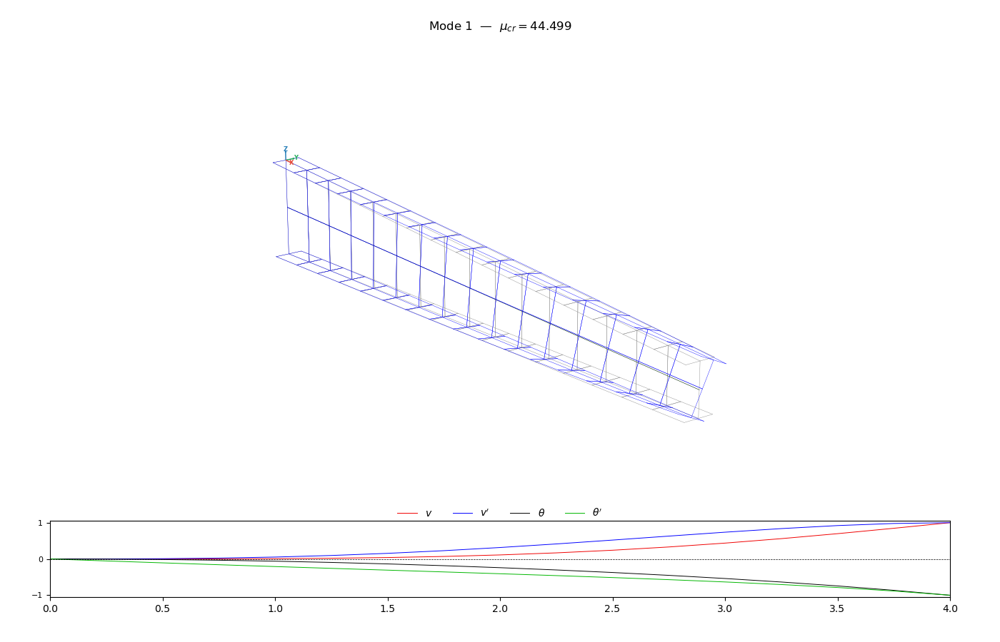

# PyLTB — Lateral-Torsional Buckling Analysis in Python

A finite element solver for **elastic lateral-torsional buckling (LTB)** of steel I-beams.
Supports doubly and singly symmetric sections, linearly tapered members, arbitrary boundary conditions, intermediate elastic restraints, and general distributed and point load configurations.

> Developed as part of a Master's thesis in Structural Engineering.

---

<p align="center">
  
  
</p>

---

## Features

- **Uniform and tapered I-beams**.
- **Monosymmetric and Bisymmetric sections** with full computation of geometric properties$.
- **Load height effect** — loads applied at the top flange, bottom flange, shear center, or any custom height.
- **Intermediate elastic restraints** — translational and torsional springs at any node, at any height.
- **Plotting** — internal force diagrams (N, V, M), deflected shape, and 3D buckling mode shapes.

---

## Installation

```bash
pip install pyltb
```

Dependencies: `numpy`, `scipy`, `matplotlib`.

---

## How it works

The analysis runs in two sequential steps.

**Step 1 — Static pre-analysis.**
The in-plane stiffness matrix is assembled and the system $\mathbf{K}_0 \mathbf{u} = \mathbf{F}$ is solved for nodal displacements and internal forces $(N, V, M)$ along the beam.

**Step 2 — Buckling analysis.**
The geometric stiffness matrix $\mathbf{K}_g$ is assembled using the internal forces from Step 1. The critical load multiplier $\mu_{cr}$ and buckling mode shapes $\boldsymbol{\phi}$ are obtained by solving the generalized eigenvalue problem:

$$(\mathbf{K}_0 - \mu_{cr}\,\mathbf{K}_g)\,\boldsymbol{\phi} = \mathbf{0}$$

The formulation follows **Beyer et al. (2015)**, which handles non-uniform members, arbitrary boundary conditions, load height effects, and intermediate restraints within a unified framework.

---

## Quick start

```python
import numpy as np
import matplotlib.pyplot as plt
from pyltb.material import Material
from pyltb.sections.section_ms import ISection_MS
from pyltb.sections.section_utils import build_mesh
from pyltb.model import StabilityModel
from pyltb.static import StaticSolver
from pyltb.stability import StabilitySolver

# --- Material (units: N, m) ---
steel = Material(E=2.1e11, nu=0.3, rho=7850)

# --- Section (monosymmetric I) ---
sec1 = ISection_MS(h=0.61, bf1=0.18, bf2=0.18,
                   tw=0.008, tf1=0.010, tf2=0.010,
                   r1=0.00, r2=0.00)

sec2 = ISection_MS(h=0.305, bf1=0.18, bf2=0.18,
                   tw=0.008, tf1=0.010, tf2=0.010,
                   r1=0.00, r2=0.00)

# --- Mesh: 10 elements, L = 6 m ---
section_order = [sec1, sec2]
section_breakpoints = [0.0, 1.0]

L = 6
n = 10
nodes, sections, elements_data = build_mesh(L, section_breakpoints,
                                            section_order, nelems, 
                                            etype=1, mat_id=0)


# --- Boundary conditions ---
# Cantiliver: all displacements and rotations fixed at the start
verax_restraints = np.array([[0,  1, 1, 1]])
lator_restraints = np.array([[0,  1, 1, 1, 1]])

# --- Loads: vertical tip-load on top flange (pos=3) ---
Q = 1000.0  # N
nodal_loads = np.array([[n,  0, 3,   0.0, 0.0,   0.0, -Q, 0.0]])

# --- Model ---
model = StabilityModel()
model.add_materials([steel])
model.add_sections(sections)
model.add_nodes(nodes)
model.add_tapered_elements(elements_data, align=3)
model.add_verax_restraints(verax_restraints)
model.add_lator_restraints(lator_restraints)
model.add_nodal_loads(nodal_loads)
model.summary()

# --- Solve ---
static = StaticSolver(model).solve()
stabi  = StabilitySolver(model).solve()

# --- Results ---
static.summary()
stabi.summary()

# --- Plots ---
static.plot()
stabi.plot(imode=0, scale=0.015)
plt.show()
```

---

## Examples
### Simple supported beam — distributed uniform load

<p align="center">
  
</p>

```bash
python tests/uniform_monosym2.py
```

### Cantiliver tapered beam — point load at tip

<p align="center">
  
</p>

```bash
python test/example1a.py
```

### Simple supported double tapered beam — point load at center

<p align="center">
  
</p>

```bash
python tests/example4.py
```

---

## Load and boundary condition reference

### Section reference heights

| Code | Position |
|:----:|----------|
| `0`  | Centroid |
| `1`  | Shear center |
| `2`  | Bottom flange |
| `3`  | Top flange |

### Distributed element loads

```python
# [id_elem, qxpos, qzpos, qxez, qzez, qxi, qzi, qxj, qzj]
model.add_elem_loads(np.array([
    [0,  0, 3,   0, 0,    0, -10,  0, -10]   # vertical downward load on top flange, element 0
]))
```

### Nodal point loads

```python
# [node, fxpos, fzpos, fxez, fzez, Fx, Fz, Mx]
model.add_nodal_loads(np.array([
    [5,  0, 3,   0, 0,    0, -50, 0]   # 50 N downward at top flange, node 5
]))
```

### Intermediate elastic restraints

```python
# [node, pos, kv, kdv, kt, kdt]
model.add_lateral_springs(np.array([
    [5,  2,  1e4,  0,  0,  0]   # lateral spring at bottom flange, node 5
]))
```

---

## Reference

> Beyer et al. (2015).
> *Elastic stability of uniform and non-uniform members with arbitrary boundary conditions and intermediate lateral restraints.*
> Annual Stability Conference.

---

## Citation

This code was developed as part of a Master's thesis (in progress). A citation will be added upon publication. If you use this software, please acknowledge it.

---

## License

MIT License
