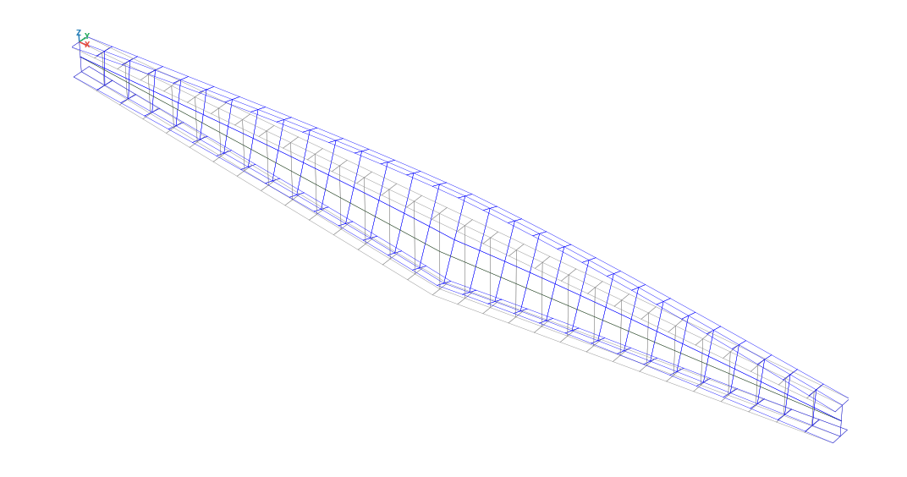
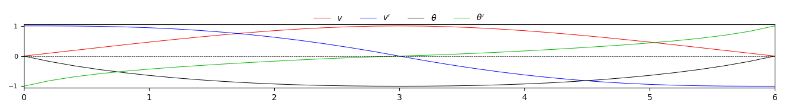
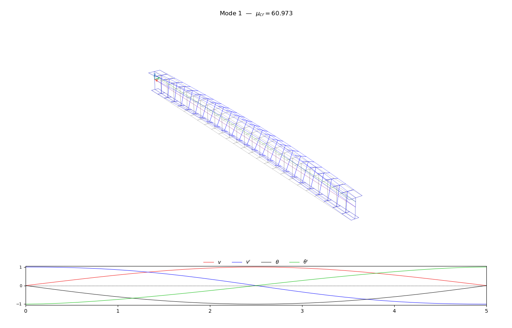
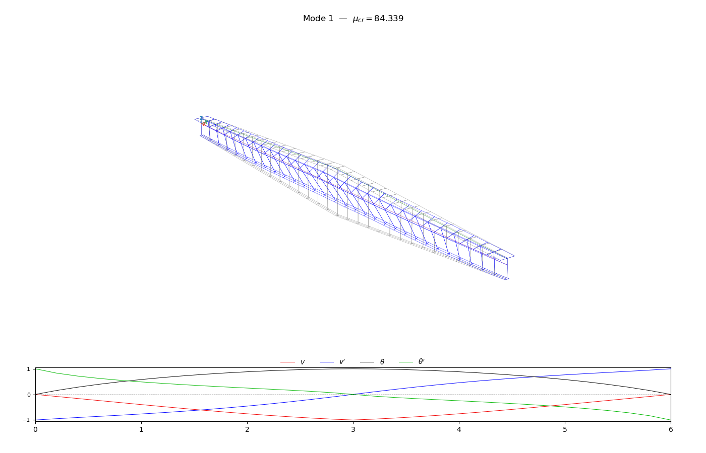

# PyLTB — Lateral-Torsional Buckling Analysis in Python

A finite element solver for **elastic lateral-torsional buckling (LTB)** of steel I-beams.
Supports doubly and singly symmetric sections, linearly tapered members, arbitrary boundary conditions, intermediate elastic restraints, and general distributed and point load configurations.

> Developed as part of a Master's thesis in Structural Engineering.

---

<p align="center">
  
  
</p>

---

## Features

- **Uniform and tapered I-beams**.
- **Monosymmetric and Bisymmetric sections** with full computation of geometric properties.
- **Load height effect** — loads applied at the top flange, bottom flange, shear center, or any custom height.
- **Intermediate elastic restraints** — translational and torsional springs at any node, at any height.
- **Plotting** — internal force diagrams (N, V, M), deflected shape, and 3D buckling mode shapes.

---

## Installation

```bash
pip install git+https://github.com/jorgeluismedina/PyLTB
```

Dependencies: `numpy`, `scipy`, `matplotlib`.

---

## How it works

The analysis runs in two sequential steps.

**Step 1 — Static pre-analysis.**
The in-plane stiffness matrix is assembled and the system $\mathbf{K}_0 \mathbf{u} = \mathbf{F}$ is solved for nodal displacements and internal forces $(N, V, M)$ along the beam.

**Step 2 — Buckling analysis.**
The geometric stiffness matrix $\mathbf{K}_g$ is assembled using the internal forces from Step 1. The critical load multiplier $\mu_{cr}$ and buckling mode shapes $\boldsymbol{\phi}$ are obtained by solving the generalized eigenvalue problem:

$$(\mathbf{K}_0 - \mu_{cr}\,\mathbf{K}_g)\,\boldsymbol{\phi} = \mathbf{0}$$

The formulation follows **Beyer et al. (2015)**, which handles non-uniform members, arbitrary boundary conditions, load height effects, and intermediate restraints within a unified framework.

---

## Quick start

```python
import numpy as np
import matplotlib.pyplot as plt
from pyltb.material import Material
from pyltb.sections.section_ms import ISection_MS
from pyltb.sections.section_utils import build_mesh
from pyltb.model import StabilityModel
from pyltb.static import StaticSolver
from pyltb.stability import StabilitySolver

# --- Material (units: N, m) ---
steel = Material(E=2.1e11, nu=0.3, rho=7850)

# --- Section (monosymmetric I) ---
sec1 = ISection_MS(h=0.61, bf1=0.18, bf2=0.18,
                   tw=0.008, tf1=0.010, tf2=0.010,
                   r1=0.00, r2=0.00)

sec2 = ISection_MS(h=0.305, bf1=0.18, bf2=0.18,
                   tw=0.008, tf1=0.010, tf2=0.010,
                   r1=0.00, r2=0.00)

# --- Mesh: 10 elements, L = 6 m ---
section_order = [sec1, sec2]
section_breakpoints = [0.0, 1.0]

L = 6
n = 10
nodes, sections, elements_data = build_mesh(L, section_breakpoints,
                                            section_order, nelems=n, 
                                            etype=1, mat_id=0)


# --- Boundary conditions ---
# Cantilever: all displacements and rotations fixed at the start
verax_restraints = np.array([[0,  1, 1, 1]])
lator_restraints = np.array([[0,  1, 1, 1, 1]])

# --- Loads: vertical tip-load on top flange (pos=3) ---
Q = 1000.0  # N
nodal_loads = np.array([[n,  0, 3,   0.0, 0.0,   0.0, -Q, 0.0]])

# --- Model ---
model = StabilityModel()
model.add_materials([steel])
model.add_sections(sections)
model.add_nodes(nodes)
model.add_tapered_elements(elements_data, align=3)
model.add_verax_restraints(verax_restraints)
model.add_lator_restraints(lator_restraints)
model.add_nodal_loads(nodal_loads)
model.summary()

# --- Solve ---
static = StaticSolver(model).solve()
stabi  = StabilitySolver(model).solve()

# --- Results ---
static.summary()
stabi.summary()

# --- Plots ---
static.plot()
stabi.plot(imode=0, scale=0.015)
plt.show()
```

---

## Examples
The following examples show the first buckling mode of three beam-columns with different BC's, geometry and loads
### Simple supported beam — distributed uniform load

<p align="center">
  
</p>

```bash
python tests/uniform_monosym2.py
```

### Cantilever tapered beam — point load at tip

<p align="center">
  
</p>

```bash
python tests/example1a.py
```

### Simple supported double tapered beam — point load at center

<p align="center">
  
</p>

```bash
python tests/example4.py
```

---

## Load and boundary condition reference

All inputs below are `numpy` arrays with a **fixed column layout**. Each `add_*` call *replaces* the
previous data of its kind, so pass every node/element in a single array.

### Conventions

`x` runs along the member, `z` is vertical (**positive upwards**, so a downward load is negative),
`y` is lateral. The two steps use separate DOF systems, indexed by the same node numbering:

| System | DOFs per node | Used by |
|--------|---------------|---------|
| `verax` (in-plane) | `u`, `w`, `w'` | static analysis — Step 1 |
| `lator` (out-of-plane) | `v`, `v'`, `θ`, `θ'` | buckling analysis — Step 2 |

Both sets of restraints are normally needed: without `verax` supports Step 1 is singular.

### Section reference heights

Load and spring heights use a position code, plus an optional relative eccentricity `ez` on top of
it (e.g. `pos=3, ez=-0.05` → 5 cm below the top flange):

| Code | Position | z from centroid |
|:----:|----------|-----------------|
| `0`  | Centroid | `0` |
| `1`  | Shear center | `zS` |
| `2`  | Bottom flange | `-zG` |
| `3`  | Top flange | `h - zG` |

### In-plane restraints — `add_verax_restraints`

```python
# [node, u, w, w']  — 1 = fixed, 0 = free; omit free nodes
model.add_verax_restraints(np.array([
    [0,       1, 1, 0],   # pin
    [nelems,  0, 1, 0],   # roller
]))
```

Pin `1,1,0` · roller `0,1,0` · clamped `1,1,1`. At least one node must restrain `u`.

### Out-of-plane restraints — `add_lator_restraints`

```python
# [node, v, v', θ, θ']
model.add_lator_restraints(np.array([
    [0,       1, 0, 1, 0],   # fork support
    [nelems,  1, 0, 1, 0],
]))
```

| Condition | `v` | `v'` | `θ` | `θ'` |
|-----------|:---:|:----:|:---:|:----:|
| Fork support (standard LTB reference case) | 1 | 0 | 1 | 0 |
| Fork support, warping prevented | 1 | 0 | 1 | 1 |
| Fully clamped | 1 | 1 | 1 | 1 |
| Lateral brace only (twist free) | 1 | 0 | 0 | 0 |

Rows at intermediate nodes model rigid braces, but a restrained `v` holds the node at the local
reference axis — for a brace acting at a given height use a stiff spring instead.

### Nodal point loads — `add_nodal_loads`

```python
# [node, fxpos, fzpos, fxez, fzez, Fx, Fz, Mx]
model.add_nodal_loads(np.array([
    [n,  0, 3,   0.0, 0.0,   0.0, -1000.0, 0.0]   # 1 kN downward on the top flange
]))
```

`fxpos`/`fzpos` are height codes for `Fx`/`Fz`, `fxez`/`fzez` their relative eccentricities,
`Fx` positive in tension, `Fz` negative downwards, `Mx` the nodal bending moment.
An eccentric `Fx` adds the static moment `ΔM = -Fx·ez` (from the centroid).

### Distributed element loads — `add_elem_loads`

One row per loaded element, intensities interpolated linearly between its end nodes (`qi == qj`
for a uniform load). Must be called after the elements are created.

```python
# [id_elem, qxpos, qzpos, qxez, qzez, qxi, qzi, qxj, qzj]
elem_loads = np.array([[e, 0, 1,  0.0, 0.0,  0.0, -3000.0, 0.0, -3000.0]
                       for e in range(nelems)])   # 3 kN/m downward at the shear center
model.add_elem_loads(elem_loads)
```

Heights and eccentricities work as for nodal loads: `qz` contributes `Kg[θ,θ] += qz(x)·ez`
and an eccentric `qx` a distributed moment `m = -qx·ez`.

### Elastic restraints — `add_lateral_springs`

Nodal springs acting on the lateral-torsional problem only:

```python
# [node, pos, kv, kdv, kt, kdt]
model.add_lateral_springs(np.array([
    [n//2,  3,  1e6,  0.0,  0.0,  0.0]   # lateral spring at the top flange, mid-span
]))
```

| Column | Meaning | Units | DOF |
|--------|---------|:-----:|:---:|
| `pos` | Height code — **applies to `kv` only** | — | — |
| `kv` | Lateral translational stiffness | F/L | `v` |
| `kdv` | Lateral curvature stiffness | F | `v'` |
| `kt` | Torsional stiffness | F·L | `θ` |
| `kdt` | Warping stiffness | F | `θ'` |

A spring at height `ez` restrains the lateral displacement of that fiber, `v + ez·θ`, so it
contributes the coupled terms `-kv·ez` off-diagonal and `kv·ez²` on `θ` — which is why a top-flange
brace is far more effective than the same spring at the centroid. `kdv`, `kt` and `kdt` go straight
to their diagonal terms. A rigid brace is modelled with a penalty stiffness, e.g. `kv = E·Iy·1e6`.

---

## Reference

> Beyer et al. (2015).
> *Elastic stability of uniform and non-uniform members with arbitrary boundary conditions and intermediate lateral restraints.*
> Annual Stability Conference.

---

## Citation

This code was developed as part of a Master's thesis (in progress). A citation will be added upon publication. If you use this software, please acknowledge it.

---

## License

MIT License
